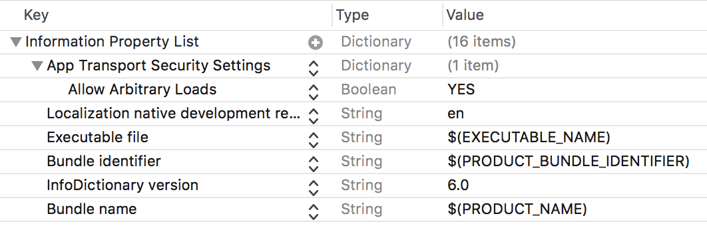

## ShelfView (iOS) ##

*iOS custom view to display books on shelf* `     ` **([Android version is available here](https://github.com/tdscientist/ShelfView))** 

 

Requirements
--------

* iOS 10.0+
* Swift 4.2


Installation
--------

`ShelfView` is available through [CocoaPods](https://cocoapods.org/). To install
it, simply add the following line to your Podfile:

```ruby
pod 'ShelfView'
```


**Note**
--------
Because of book covers whose URLs are `http`, update your `info.plist` as follows:

* add `App Transport Security Settings` to the list
* add `Allow Arbitrary Loads` to the security settings added above; set it to `YES`.



Plain Shelf
--------

```swift
import ShelfView

class PlainShelfController: UIViewController, PlainShelfViewDelegate {
var shelfView: PlainShelfView!

override func viewDidLoad() {
super.viewDidLoad()

let books = [
BookModel(bookCoverSource: "https://files.kerching.raywenderlich.com/covers/d5693015-46b6-44f8-bf7b-7a222b28d9fe.png", bookId: "0", bookTitle: "Realm: Building Modern Swift Apps with Realm"),
BookModel(bookCoverSource: "https://encrypted-tbn0.gstatic.com/images?q=tbn:ANd9GcTYEkCQ_wu8HoGJzzs_gUH_FVusgI2RhntBKQ-WkmqnDJZnriwY6Q", bookId: "1", bookTitle: "iOS 10 by Tutorials: Learning the new iOS APIs with Swift 3")
]        

shelfView = PlainShelfView(frame: CGRect(x: 0, y: 0, width: 350, height: 500), bookModel: books, bookSource: PlainShelfView.BOOK_SOURCE_URL)

shelfView.delegate = self
self.view.addSubview(shelfView)
}

func onBookClicked(_ shelfView: PlainShelfView, index: Int, bookId: String, bookTitle: String) {
print("I just clicked \"\(bookTitle)\" with bookId \(bookId), at index \(index)")
}

}
```


Section Shelf
--------

```swift
import ShelfView

class SectionShelfController: UIViewController, SectionShelfViewDelegate {
var shelfView: SectionShelfView!

override func viewDidLoad() {
super.viewDidLoad()

let books = [
BookModel(bookCoverSource: "https://files.kerching.raywenderlich.com/covers/d5693015-46b6-44f8-bf7b-7a222b28d9fe.png", bookId: "0", bookTitle: "Realm: Building Modern Swift Apps with Realm"),
BookModel(bookCoverSource: "https://encrypted-tbn0.gstatic.com/images?q=tbn:ANd9GcTYEkCQ_wu8HoGJzzs_gUH_FVusgI2RhntBKQ-WkmqnDJZnriwY6Q", bookId: "1", bookTitle: "iOS 10 by Tutorials: Learning the new iOS APIs with Swift 3")
]
let bookModelSectionArray = [BookModelSection(sectionName: "RAYWENDERLICH", sectionId: "0", sectionBooks: books)]

shelfView = SectionShelfView(frame: CGRect(x: 0, y: 0, width: 350, height: 500), bookModelSection: bookModelSectionArray, bookSource: SectionShelfView.BOOK_SOURCE_URL)

shelfView.delegate = self
self.view.addSubview(shelfView)
}

func onBookClicked(_ shelfView: SectionShelfView, section: Int, index: Int, sectionId: String, sectionTitle: String, bookId: String, bookTitle: String) {
print("I just clicked \"\(bookTitle)\" with bookId \(bookId), at index \(index). Section details --> section \(section), sectionId \(sectionId), sectionTitle \(sectionTitle)")
}

}
```

**Add more books to ShelfView**
* Plain Shelf
```swift
addBooks(bookModel: [BookModel])
```
* Section Shelf
```swift
addBooks(bookModelSection: [BookModelSection])
```

**Reload books on ShelfView**
* Plain Shelf
```swift
reloadBooks(bookModel: [BookModel])
```
* Section Shelf
```swift
reloadBooks(bookModelSection: [BookModelSection])
```


**Loading book covers from other sources**

* iPhone/iPad document directory

```swift
let books = [
BookModel(bookCoverSource: "bookcover0.png", bookId: "0", bookTitle: "Book Title 0"),
BookModel(bookCoverSource: "bookcover1.png", bookId: "1", bookTitle: "Book Title 1")
]
shelfView = PlainShelfView(frame: CGRect(x: 0, y: 0, width: 350, height: 500), bookModel: books, bookSource: PlainShelfView.BOOK_SOURCE_DEVICE_DOCUMENTS)
``` 


* iPhone/iPad library directory

```swift
let books = [
BookModel(bookCoverSource: "bookcover0.png", bookId: "0", bookTitle: "Book Title 0"),
BookModel(bookCoverSource: "bookcover1.png", bookId: "1", bookTitle: "Book Title 1")
]
shelfView = PlainShelfView(frame: CGRect(x: 0, y: 0, width: 350, height: 500), bookModel: books, bookSource: PlainShelfView.BOOK_SOURCE_DEVICE_LIBRARY)
```

* iPhone/iPad cache directory

```swift
let books = [
BookModel(bookCoverSource: "bookcover0.png", bookId: "0", bookTitle: "Book Title 0"),
BookModel(bookCoverSource: "bookcover1.png", bookId: "1", bookTitle: "Book Title 1")
]
shelfView = PlainShelfView(frame: CGRect(x: 0, y: 0, width: 350, height: 500), bookModel: books, bookSource: PlainShelfView.BOOK_SOURCE_DEVICE_CACHE)
``` 

* Directly from your project's source code

```swift
let books = [
BookModel(bookCoverSource: "bookcover0.png", bookId: "0", bookTitle: "Book Title 0"),
BookModel(bookCoverSource: "bookcover1.png", bookId: "1", bookTitle: "Book Title 1")
]
shelfView = PlainShelfView(frame: CGRect(x: 0, y: 0, width: 350, height: 500), bookModel: books, bookSource: PlainShelfView.BOOK_SOURCE_RAW)
``` 


License
--------

`ShelfView` is available under the MIT license. See the LICENSE file for more info.

Author
--------

Adeyinka Adediji _(tdscientist@gmail.com)_


Contributions & Bug Reporting
--------

tdscientist@gmail.com 

Credits 
--------

* [Kingfisher](https://github.com/onevcat/Kingfisher)

